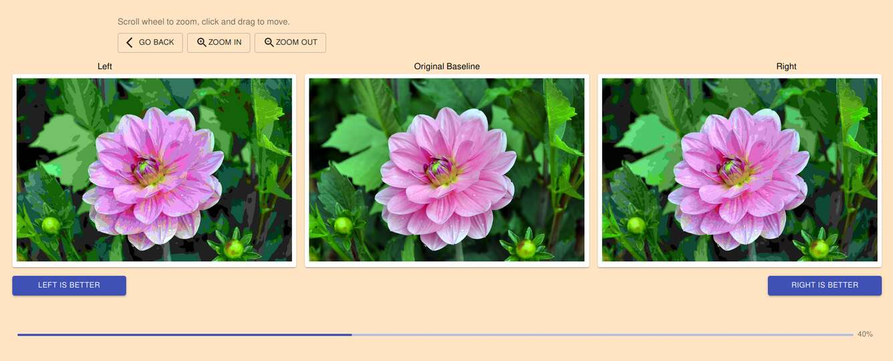

# Image Survey

Do qualitative image comparison surveys where 2 image variants are compared against an original.

[A demo is available.](https://imagesurvey.kaangenc.me/)



## Requirements

For the backend:

* `python` 3.7 or newer, and `pip`
* `sqlite` 3.24.0 or newer

For the frontend:

* `nodejs`
* `npm` or `yarn`

Alternatively, all dependencies are included when using `docker` and
`docker-compose` with the provided files.

## Usage

First, pull the repository.

``` shell
git pull 'https://github.com/SeriousBug/image-survey.git'
```

Next, add your images to the `image-files` folder. A readme file is provided in
the folder on naming conventions.

Then, go to the `ui` folder, copy the file `.env` to `.env.local`, then modify
`.env.local` to customize the UI and fit your setup.


### Docker

First, enter the `/etc` directory, copy `image-survey.sample.yaml` as
`image-survey.yaml`, and change the line `AUTH_SECRET` to some random value.
Please do not modify any other option.

A `docker-compose.yaml` file is provided for your convenience. You can use this
file to build and run the service by running the following command:

``` shell
docker-compose up -d
```

Alternatively, you can build and run the container directly. To do so, run the following command to build the container.

``` shell
docker build . --tag 'image-survey:1.0' --tag 'image-survey:latest'
```

You can then use the following command to run the service:

``` shell
docker run -v etc/:/etc/image-survey/ -v image-files/:/image-files/ -v database/:/database image-survey:latest
```

Either way, the service will now be available at `http://localhost:8000`. You
can change which port the service is located at by modifying
`docker-compose.yaml` if using docker-compose, or changing `-p 8000:8000`.


### Bare

First, install [https://python-poetry.org/](poetry). Then run the following command and the top level directory

``` shell
poetry install
```

Next, build the UI, inside the `ui` directory.

``` shell
npm install # or yarn
npm run build # or yarn build
```


Finally, run the service. At the top level directory:

``` shell
poetry run image-survey
```

## Development

If you are working on modifying this codebase, you can follow these commands to set up your development environment.

```shell script
poetry install
poetry run image-survey

# In a different terminal
cd ui
yarn
yarn start
```

Yarn starts a development server to serve the UI, make sure to use that so that
you see any changes you make to the UI without having to do a full rebuild.

Use the script `misc/lint.sh` to automatically format and lint your code.

Add tests under the `tests/` folder. You can run tests and get coverage reports using:

``` shell
poetry run coverage run -m ward
poetry run coverage report
```
